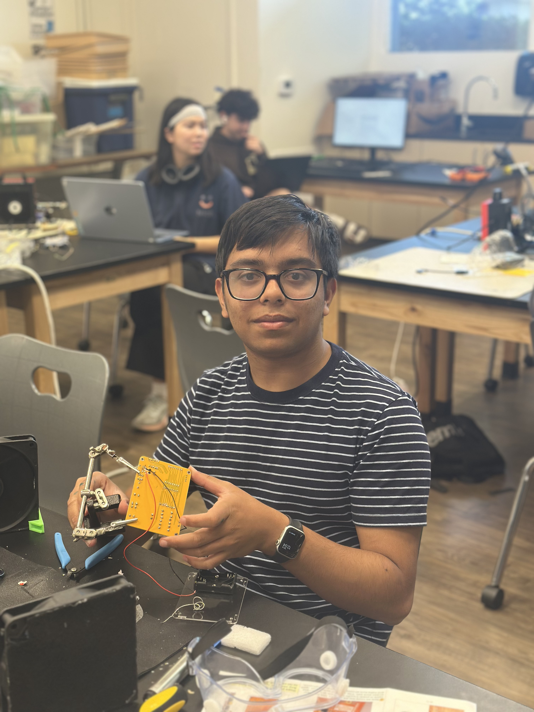
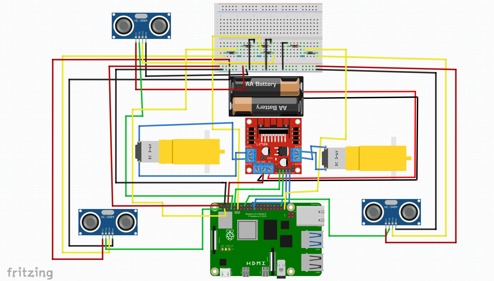

# Ball Tracking Rover
The project involves building a Raspberry PI-based robot that tracks a ball as a simulation of sample and hazard detection. It uses the OpenCV python library for computer vision, which is used to draw bounding boxes around where the ball could possibly be. In addition, the rover performs topography analysis on factors such as tilt and orientation to determine its location, while also tracking planets.
<!--- This is an HTML comment in Markdown -->
<!--- Anything between these symbols will not render on the published site -->

| **Engineer** | **School** | **Area of Interest** | **Grade** |
|:--:|:--:|:--:|:--:|
| Palash A | Cupertino HS | Aerospace Engineering | Incoming Junior


  
<!--**# Final Milestone

**Don't forget to replace the text below with the embedding for your milestone video. Go to Youtube, click Share -> Embed, and copy and paste the code to replace what's below.**

<iframe width="560" height="315" src="https://www.youtube.com/embed/F7M7imOVGug" title="YouTube video player" frameborder="0" allow="accelerometer; autoplay; clipboard-write; encrypted-media; gyroscope; picture-in-picture; web-share" allowfullscreen></iframe>

For your final milestone, explain the outcome of your project. Key details to include are:
- What you've accomplished since your previous milestone
- What your biggest challenges and triumphs were at BSE
- A summary of key topics you learned about
- What you hope to learn in the future after everything you've learned at BSE


# Second Milestone

**Don't forget to replace the text below with the embedding for your milestone video. Go to Youtube, click Share -> Embed, and copy and paste the code to replace what's below.**

<iframe width="560" height="315" src="https://www.youtube.com/embed/y3VAmNlER5Y" title="YouTube video player" frameborder="0" allow="accelerometer; autoplay; clipboard-write; encrypted-media; gyroscope; picture-in-picture; web-share" allowfullscreen></iframe>

For your second milestone, explain what you've worked on since your previous milestone. You can highlight:
- Technical details of what you've accomplished and how they contribute to the final goal
- What has been surprising about the project so far
- Previous challenges you faced that you overcame
- What needs to be completed before your final milestone -->
<!--**Don't forget to replace the text below with the embedding for your milestone video. Go to Youtube, click Share -> Embed, and copy and paste the code to replace what's below.**

<iframe width="560" height="315" src="https://www.youtube.com/embed/CaCazFBhYKs" title="YouTube video player" frameborder="0" allow="accelerometer; autoplay; clipboard-write; encrypted-media; gyroscope; picture-in-picture; web-share" allowfullscreen></iframe>

For your first milestone, describe what your project is and how you plan to build it. You can include:
- An explanation about the different components of your project and how they will all integrate together
- Technical progress you've made so far
- Challenges you're facing and solving in your future milestones
- What your plan is to complete your project -->
# First Milestone
## Summary
  My project is a ball tracking rover that uses raspberry PI to perform topography analysis, planet tracking, and also create a graph       charting the ball's distance from the robot. After creating diagrams on paper and a schematic online, for my first milestone I have completed the base of th robot, which included attaching the motors, the battery case, and wheels. 
## Challenges
  While assembling the hardware, sometimes it was hard to tell which size screws were needed to mount a component. Initially, my screws to secure the battery case were too small and kept falling out, however I eventually pivoted to a larger size which worked better in securing it. Additionally, when making the schematic online on fritzing, the hardest part was making the voltage divider on the breadboard. Before making the schematic, I did not have a ton of electrical experience, but eventually I was able to learn how they work. In the schematic below, you can see that there are 3 voltage dividers, 1 for each sensor, and the resistors are in parallel.
  
## Next Steps
  Now that the base of the robot is assembled and planning has been done, I will need to wire the electronics together on the robot using the schematic. Once all these electronics are funcitoning correctly and are mounted onto the robot, I can start writing the full code for the robot.
<!--Here's where you'll put images of your schematics. [Tinkercad](https://www.tinkercad.com/blog/official-guide-to-tinkercad-circuits) and [Fritzing](https://fritzing.org/learning/) are both great resoruces to create professional schematic diagrams, though BSE recommends Tinkercad becuase it can be done easily and for free in the browser. -->

# Starter Project
## Summary
  For my starter project I chose the retro arcade console. The console has 5 games in its system (which I didn't correctly figure out until after filming the milestone video). Much of the project encompassed soldering buttons and other game components onto a PCB. After screwing on the battery case on the back, I screwed on the front and back lids of the console. Overall, this starter project helped me solidify my soldering skills.
## Challenges
  A lot of times when I was soldering I accidentally added too much solder, which was especially tedious to avoid for smaller solder points that were closer together. If two solder points are connected by solder, it will cause a short circuit. Fortunately, I learned a couple of techniques to fix these errors. A lot of times, applying the soldering iron on the solder will remelt it and make it flow into the hole. I also ended up using the solder sucker a lot to remove excess solder from the board.

<!---# Code
Here's where you'll put your code. The syntax below places it into a block of code. Follow the guide [here]([url](https://www.markdownguide.org/extended-syntax/)) to learn how to customize it to your project needs. 

```c++
void setup() {
  // put your setup code here, to run once:
  Serial.begin(9600);
  Serial.println("Hello World!");
}

void loop() {
  // put your main code here, to run repeatedly:

Here's where you'll list the parts in your project. To add more rows, just copy and paste the example rows below.
Don't forget to place the link of where to buy each component inside the quotation marks in the corresponding row after href =. Follow the guide [here]([url](https://www.markdownguide.org/extended-syntax/)) to learn how to customize this to your project needs. 
} -->

# Bill of Materials

| **Part** | **Note** | **Price** | **Link** |
|:--:|:--:|:--:|:--:|
| Raspberry Pi 4 | Contains the microcomputer where code is uploaded to, and controls what actions other parts perform | $38.50 | <a href="https://www.adafruit.com/product/4295?gad_source=1&gad_campaignid=21079227318&gbraid=0AAAAADx9JvSGLBIm3AzeKDsMgLScOARTP&gclid=CjwKCAjwmJjSBhB-EiwAkZgxi-BMiWTt63thvUL53uiCCwRKV9zTqj1L6AnmZTy36jFEQFqJ9GdmBRoCNYUQAvD_BwE"> Link </a> |
| Raspberry Pi Camera Module | Camera that enables the robot to see and track the ball | $17.50 | <a href="https://vilros.com/products/products-raspberry-pi-camera-module-v2?variant=41308152627294&country=US&currency=USD&utm_medium=product_sync&utm_source=google&utm_content=sag_organic&utm_campaign=sag_organic&tw_source=google&tw_adid=&tw_campaign=19684058556&gad_source=1&gad_campaignid=19684058613&gbraid=0AAAAAD1QJAgA2hfDQwtcLNVkXxnWLVsF3&gclid=CjwKCAjwpK3SBhASEiwAtV1SPIN0OsGS5exVahvvqlmi4ZyuIY9AEKJi6pscUGfG7IIYwvgnaQwhyRoChTcQAvD_BwE"> Link </a> |
| L298N Driver Board | Provides power to the motors, in different combinations that affect the movement of the robot, which is determined by the code uploaded into the raspberry pi | $Price | <a href="https://www.amazon.com/Arduino-A000066-ARDUINO-UNO-R3/dp/B008GRTSV6/"> Link </a> |
| Motors and Board Kit | Contains all the parts needed to assemble the base of the robot | $Price | <a href="https://www.amazon.com/Arduino-A000066-ARDUINO-UNO-R3/dp/B008GRTSV6/"> Link </a> |
| Power bank | What the item is used for | $Price | <a href="https://www.amazon.com/Arduino-A000066-ARDUINO-UNO-R3/dp/B008GRTSV6/"> Link </a> |
| HC-SR04 Sensors (5 pcs) | What the item is used for | $5.25 | <a href="https://www.sparkfun.com/ultrasonic-distance-sensor-hc-sr04.html?srsltid=AfmBOoqFrVAtpwHDCejRn62wEtzgnn7pZzJ7Wjbl_NNX58lybzk9adbq"> Link </a> |
| HDMI to micro HDMI cable | Allows the raspberry pi to connect to a monitor with keyboard and mouse, or just a laptop after SSH has been setup | $6.99 | <a href="https://www.amazon.com/UGREEN-Adapter-Ethernet-Compatible-Raspberry/dp/B06WWQ7KLV?th=1"> Link </a> |
| Video Capture Card | What the item is used for | $15.99 | <a href="https://www.amazon.com/Capture-1080P60-Streaming-Recorder-Compatible/dp/B08Z3XDYQ7?th=1"> Link </a> |
| SD Card Reader | What the item is used for | $Price | <a href="https://www.amazon.com/Arduino-A000066-ARDUINO-UNO-R3/dp/B008GRTSV6/"> Link </a> |
| Basic Connections Components Kit | What the item is used for | $Price | <a href="https://www.amazon.com/Arduino-A000066-ARDUINO-UNO-R3/dp/B008GRTSV6/"> Link </a> |
| Female to Female Jumper Wires| One of the types of wires used to connect the components | $1.95 | <a href="https://www.digikey.com/en/products/detail/adafruit-industries-llc/1950/6827084?gclsrc=aw.ds&gad_source=1&gad_campaignid=20232005509&gbraid=0AAAAADrbLljptrgFyBRhANVYO4nOwL4mw&gclid=CjwKCAjwx7LSBhB3EiwAjcodxMaqXD3yC4neFOcPBvp2WLxwl1qzc0lilNy_xKyJw9D0pvGeaAex9BoC6K0QAvD_BwE&__cf_chl_f_tk=Uia7vvSdgHEdaC.xTbj.fXW9Tw4Fg0STdL_glbliS3g-1783438661-1.0.1.1-jvd.UjjxgvLWgold6_GjzJ8gw_qMrPcZQiDYgfDZ4KU"> Link </a> |
| Soldering Kit | What the item is used for | $Price | <a href="https://www.amazon.com/Arduino-A000066-ARDUINO-UNO-R3/dp/B008GRTSV6/"> Link </a> |

<!--# Other Resources/Examples
One of the best parts about Github is that you can view how other people set up their own work. Here are some past BSE portfolios that are awesome examples. You can view how they set up their portfolio, and you can view their index.md files to understand how they implemented different portfolio components.
- [Example 1](https://trashytuber.github.io/YimingJiaBlueStamp/)
- [Example 2](https://sviatil0.github.io/Sviatoslav_BSE/)
- [Example 3](https://arneshkumar.github.io/arneshbluestamp/)

To watch the BSE tutorial on how to create a portfolio, click here.-->
